# Among Place and Non-Place {#first}
## Situating the Digital Public Library of America

Mark A. Matienzo   
Digital Public Library of America   
@anarchivist

British Columbia Library Association    
April 1, 2014

Slides: <http://matienzo.org/presentations/>

# What is DPLA? {.takahashi}

To start, I would first like to ask you a few questions.   
How many of you have heard of the Digital Public Library of America before?     
How many of you have used DPLA?    
If you're not familiar with DPLA, that's alright - I do understand that I'm in Canada.
The Digital Public Library of America brings together the riches of America’s libraries, archives, and museums, and makes them freely available to the world. It strives to contain the full breadth of human expression, from the written word, to works of art and culture, to records of America’s heritage, to the efforts and data of science. The DPLA aims to expand this crucial realm of openly available materials, and make those riches more easily discovered and more widely usable and used.

# The DPLA is ...

## a Portal
## a Platform
## an advocate for the Public Option

We describe DPLA in three ways:    
First, DPLA is a portal that delivers students, teachers, scholars, and the public to incredible resources, wherever they may be in America.    
Secondly, DPLA is a platform that enables new and transformative uses of our digitized cultural heritage.    
Thirdly, DPLA is an advocate for a strong public option in the twenty-first century. The DPLA works, along with like-minded organizations and individuals, to ensure that a critical, open intellectual landscape remains vibrant and broad in the face of increasingly restrictive digital options. The DPLA seeks to multiply openly accessible materials to strengthen the public option that libraries represent in their communities.

# A Portal for Discovery {.takahashi}
## [http://dp.la/](http://dp.la)

------------------

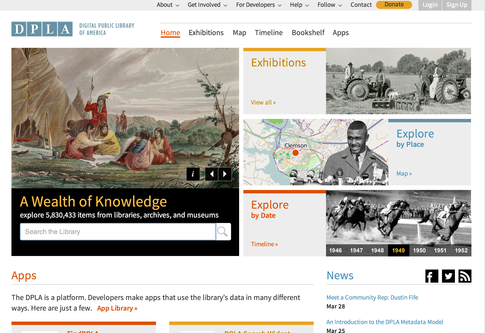

When you first visit DPLA's portal, you are given a variety of ways to find cultural materials. 

------------------

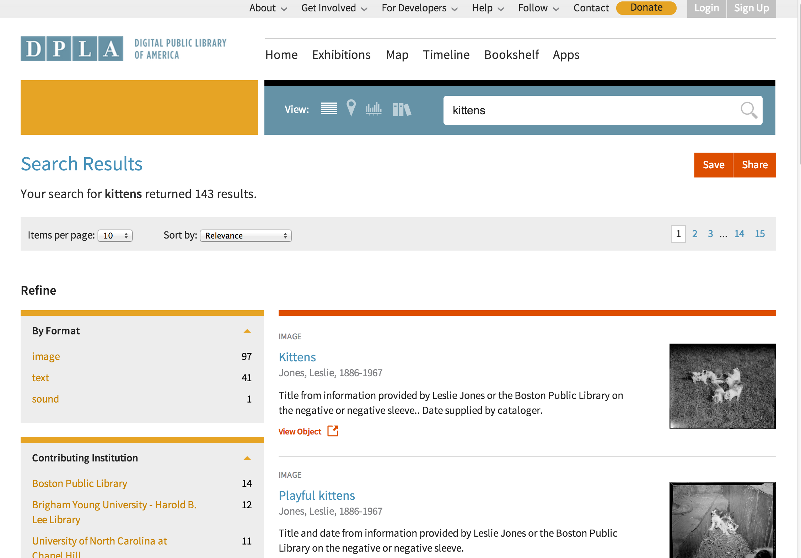

For example, you can perform simple searches, sort the results, and filter them by format, contributing institution or partner, date, language, location, or subject.

------------------

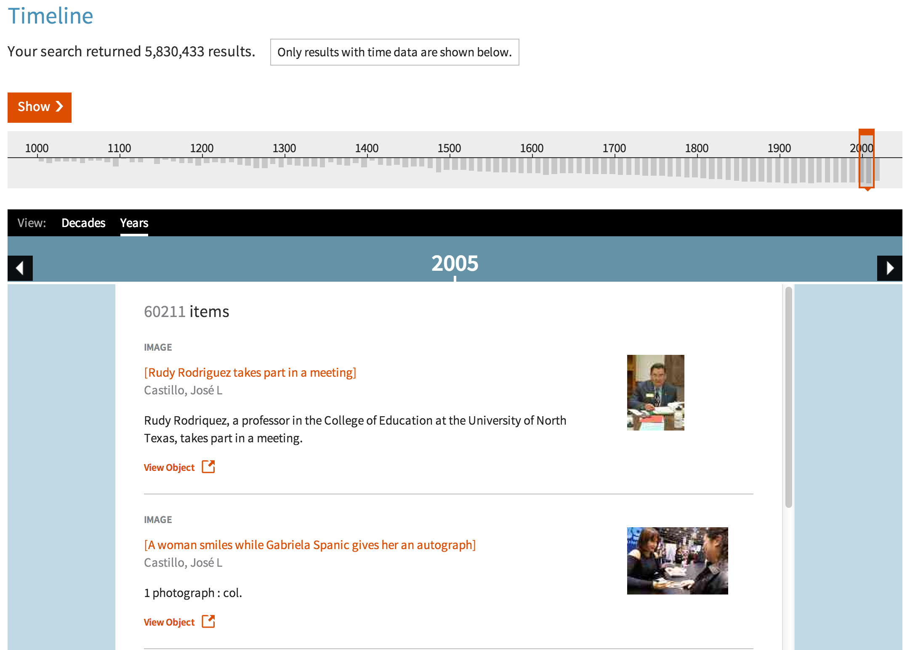

In addition to a familiar search paradigm, we provide a few additional interfaces that allow users to find and interact with collections in new ways.    
For example, we provide a timeline, which presents groupings of items or search results grouped by the date of creation or publication in an easy to browse format.
This can make it easier for some users to browse large result sets.

------------------

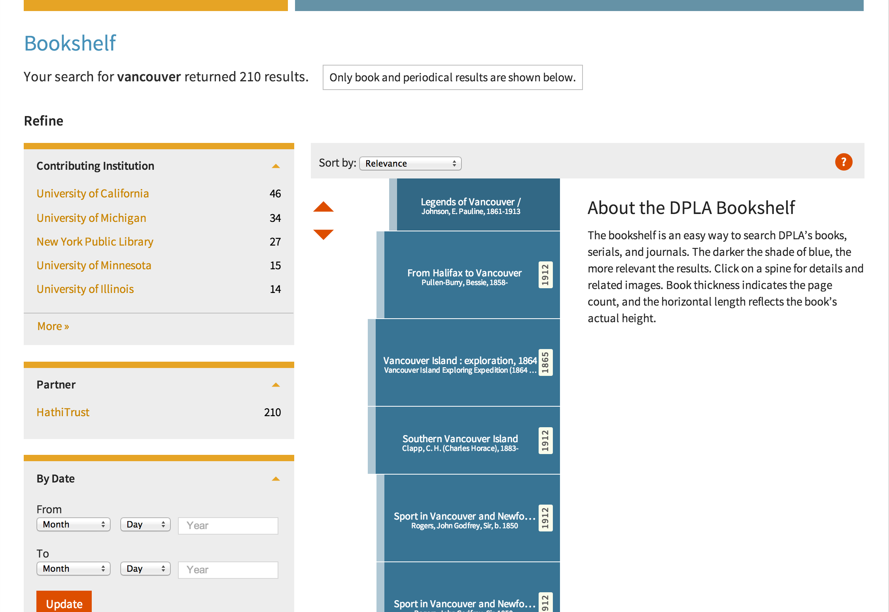

The DPLA Bookshelf provides is yet another way that we provide an innovative mechanism for users to interact with materials available through our portal.    
The items on Bookshelf represent digitized books available through the portal, from providers such as the University of California, the University of Illinois, and the New York Public Library.    
The shelf is shown as a vertical stack so that the titles and authors are more easily readable on their spines.    
The width of the book represents the actual height of the physical book, and its thickness represents its page count.    
The spine is colored with one of ten depths of blue to indicate how relevant the work is to the reader’s search.

------------------

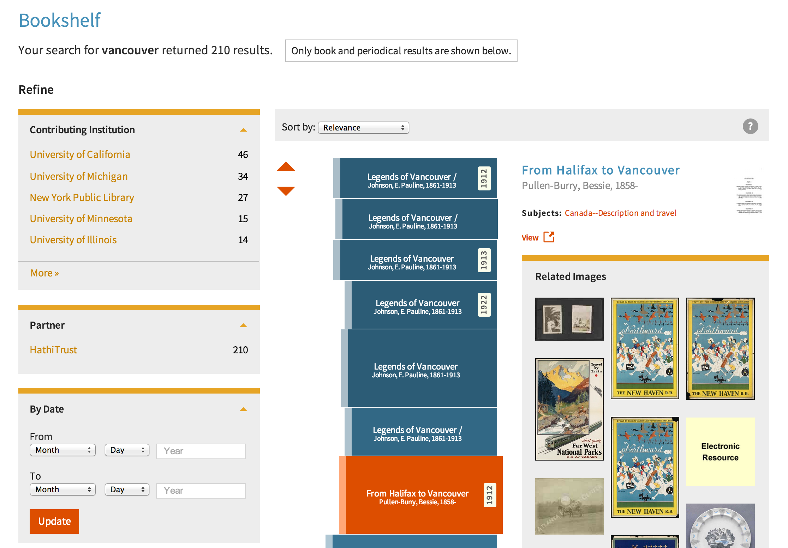

When a reader clicks on one of the books, additional information about it is displayed to its right. The reader can open the book with the click of a button.    
Further, when a reader clicks on a book, the DPLA Bookshelf displays thumbnails of images within the DPLA collection related to that book’s subject areas.    
Clicking on a thumbnail displays the image and additional information about it.

------------------

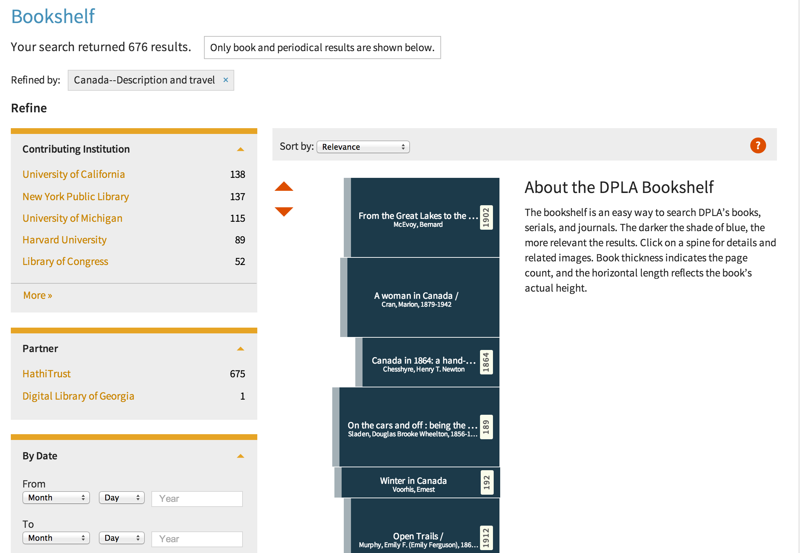

In addition, can explore further by clicking on one of the subjects under which the book has been categorized.    
This replaces the existing shelf with a shelf containing all the other books in the DPLA collection categorized under that same subject.

------------------

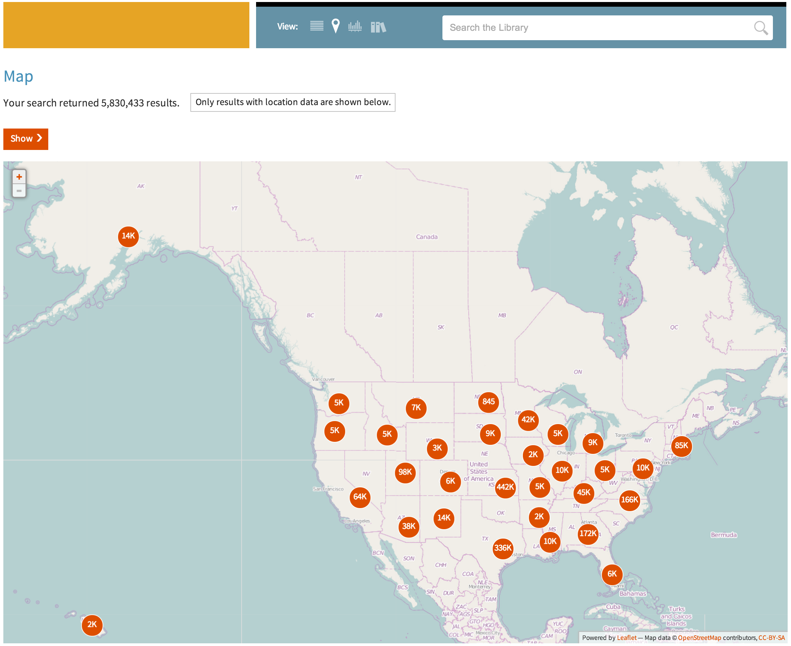

We also provide a map-based interface that allows users to identify the places associated with a given item.
I'll be talking about the map, how we augment the data we receive to produce this map, and some of the issues we've identified in the process, later in the presentation.

------------------

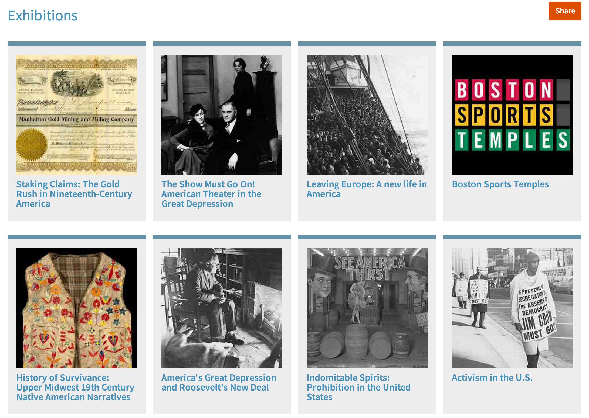

In addition to these interfaces I've just discussed, DPLA also provides curated exhibitions that provide topical or historical context to some of the items to which we enable access.

# A Platform to Build On {.takahashi}

The DPLA platform is one of the most important parts of our technical infrastructure.    
It provides us as well as our users with the ability to search and retrieve metadata ingested from our service hubs and content hubs.     
In fact, the Platform directly provides this functionality to the DPLA portal.    
Most importantly, we provide free and open access to the Platform and the metadata available from within it.

# How is it free? {.takahashi}
##  {.incremental}

The DPLA platform is one of the most important parts of our technical infrastructure.    
It provides us as well as our users with the ability to search and retrieve metadata ingested from our service hubs and content hubs.     
In fact, the Platform directly provides this functionality to the DPLA portal.    
Most importantly, we provide free and open access to the Platform and the metadata available from within it.

# Platform Data

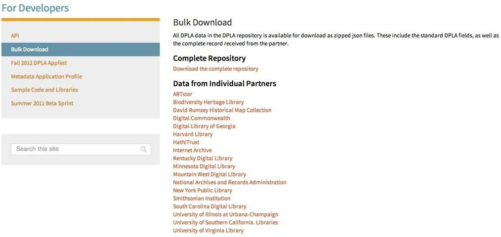

You can access our data in two ways.    
First, you can visit our website, and download all the data.

# The DPLA API {.takahashi}
## Access to millions of items, for any purpose

But the DPLA is not just a database or a website.   
It provides a set of tools that anyone can use to build their own application or interface on top of the DPLA’s aggregated data.    
This toolset is called an Application Programming Interface (API).    
APIs let computer programs talk to other computer programs, enabling application components to fit together like Lego blocks.     
Right now, the API gets more hits than the portal!

------------------

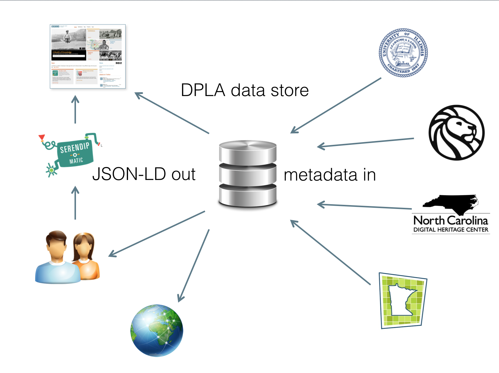

What powers the platform, the portal, and apps is our metadata within the platform.    
DPLA harvests metadata in many different formats, such as Dublin Core, MODS, MARCXML, and others.
As part of the process to bring in a partner's metadata, we map the incoming data to our Metadata Application Profile.
In this process, we also enrich the data.

------------------

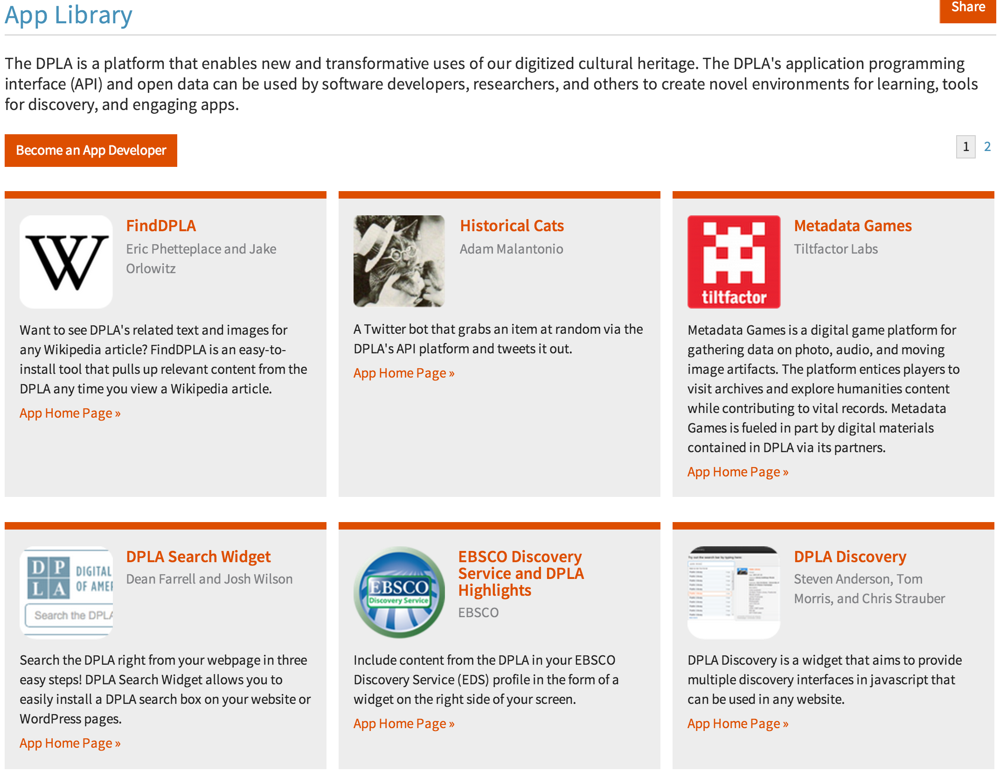

We encourage to build applications and interfaces using our API.
We also provide a public app library within which people can submit what they build to help with promotion.
In addition to the apps listed here, apps submitted to the library include OpenPics, an iOS application for access to cultural heritage images, several map-based visualizations, and Serendip-o-matic, a tool that analyzes your research materials for keywords and finds related items on DPLA and other sources.

# A Strong  Public Option {.takahashi}

For most of American history, the ability to access materials for free through public libraries has been a central part of our culture.   
The DPLA works, along with like-minded organizations and individuals, to ensure that this 
critical, open intellectual landscape remains vibrant and broad in the face of increasingly restrictive digital options.     
The DPLA seeks to multiply openly accessible materials to strengthen the public option that libraries represent in their communities.

------------------

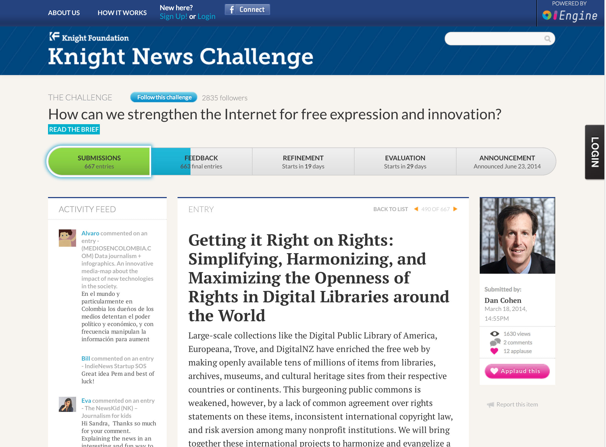

As an aggregator of metadata from many institutions, DPLA is in a unique position to help our partners recognize and manage data quality issues.   
In October 2013, Europeana and the DPLA organized a first joint rights management workshop to explore this possibility in Boston, Massachusetts.    
As a result of further discussions between the DPLA and Europeana, a small joint working group to explore the possibilities for concrete collaborations in more detail has been established.
This important work will, above all, make rights clear to the end user and provide a framework for aggregators and our partners.    
With the creation and standardization of actionable rights statements, users will know when a work is in the Public Domain, covered under a Creative Commons license or is Rights Restricted, among other possible labels.
In addition, we recently submitted an entry to the Knight Foundation's Knight News Challenge to potentially support this work. 

# How is this possible? {.takahashi}

Now, you may wonder how this is possible, because those 5.8 million items had to come from somewhere.

# DPLA Hubs {.takahashi}

We have a partnership model which we refer to as our "hubs model."    
The Hubs Program is designed to establish a national network of state and regional digital libraries, as well as large institutional digital libraries.    
The hubs model allows us to bring together digitized content from across the country into a single access point for end users, and an open platform for developers.

# Content Hubs

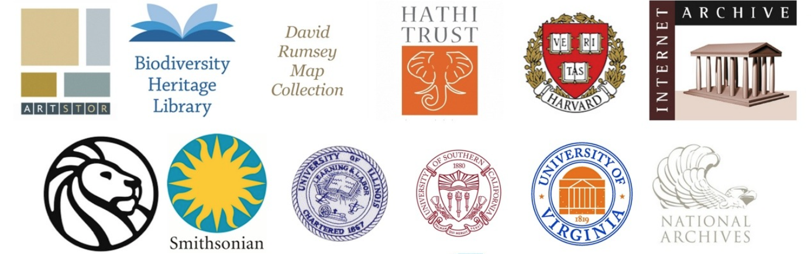

The DPLA Content Hubs are large digital libraries, museums, archives, or repositories that maintain a one-to-one relationship with the DPLA.    
Content hubs tend to be larger, with collections exceeding 250K records and content previews (such as thumbnails or low resolution clips of audio/visual material).
Content hubs work with DPLA to globalize their data, meaning that they work with DPLA to normalize, clean, update their data, and investigate new methods for data sharing.

# Service Hubs

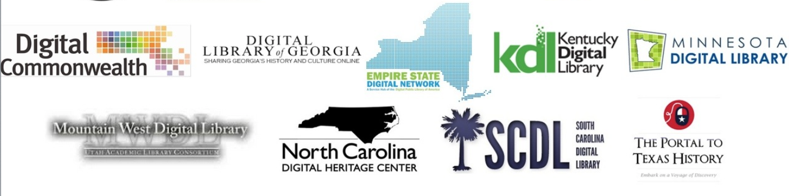

The DPLA Service Hubs are state or regional digital libraries that aggregate information about digital objects from libraries, archives, museums, and other cultural heritage institutions within its given state or region.    
Like content hubs, service hubs share data and content previews and work iwth DPLA to globalize their data. 
In addition, service hubs also represent their community as single metadata aggregation point (state, region, etc., but perhaps differently defined communities in the future).   
Each Service Hub also offers its state or regional partners a full menu of standardized digital services, including digitization, metadata, data aggregation and storage services, as well as locally hosted community outreach programs, bringing users in contact with digital content of local relevance.   

# A Network of Partners

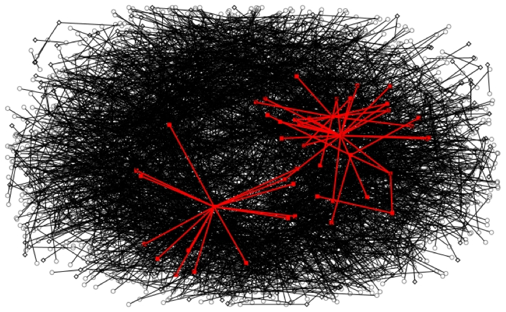

But, the DPLA is really made up of over 1,100 partners--institutions and organizations from across the US--that provide content to or are hosted by (or have some other relationship with) our Hubs. In turn, the Hubs serve up this content to DPLA. 

------------------

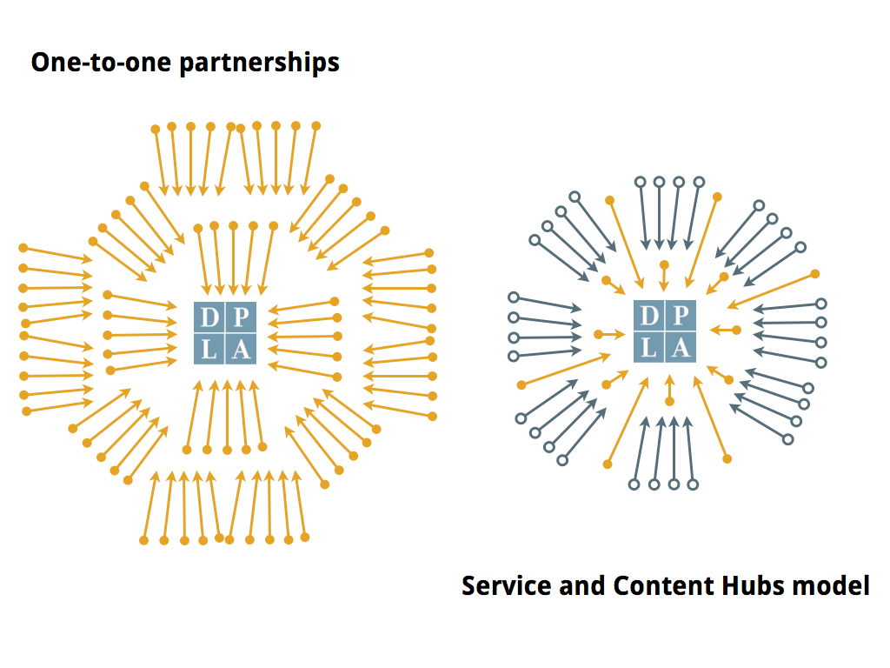

WHY THE THE HUBS MODEL? Sustainability!
    
The image on the left shows that one-to-one partnerships can be resource intensive, requiring more staffing and processing power to ingest and update, and to continually manage the variety of individual metadata standards and quality and feed types.    
The image on the right, however, represents that the Service and Content Hubs model supports the sharing of responsibilities for metadata management and feeds. It encourages collaboration, which in turn increases the likelihood of more complete and higher quality metadata and sustainable curation models. 

------------------

[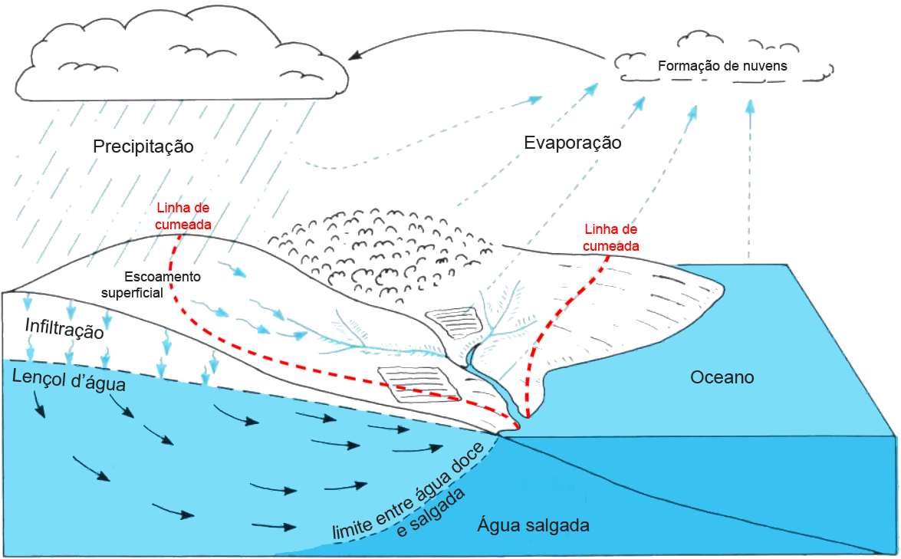](https://commons.wikimedia.org/wiki/File:Ciclo_hidrol%C3%B3gico_da_%C3%A1gua.png)

I like to think of us more like a water cycle, wherein all partners play an equally visible and valuable role in the content sharing process.

------------------

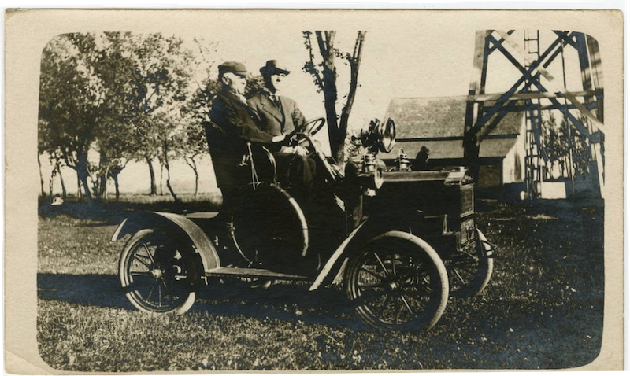

For example, The Maxwell automobile company was formed in 1904 and ceased to exist in 1925.    
You love Maxwell cars: How do you know that the image even exists?

------------------

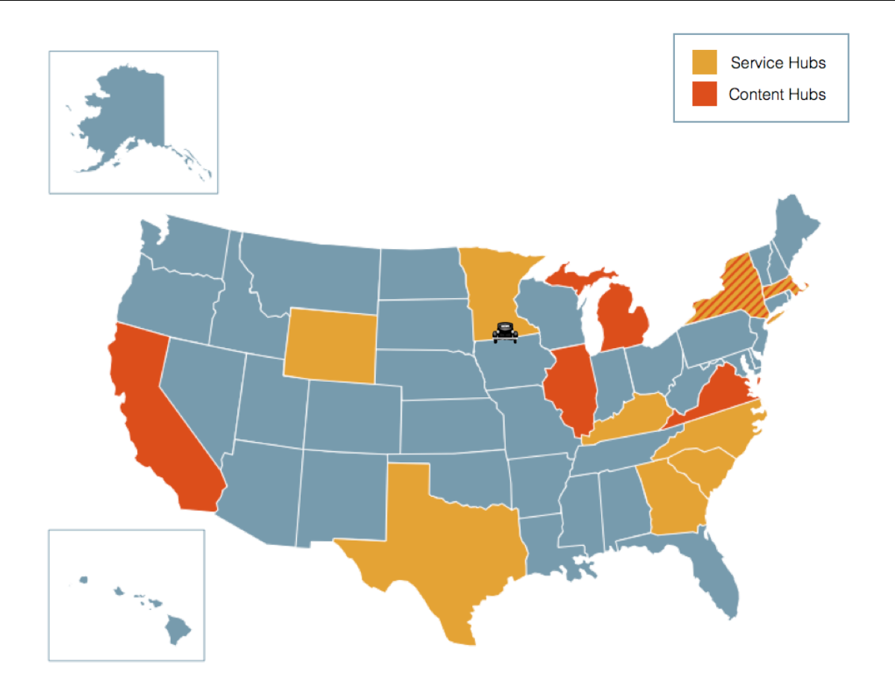

This image is from the Nicollet County Historical Society in St. Peter, Minnesota.    
NCHS doesn’t have a digital collection on their website.   
You’ve never heard of Nicollet County or even St. Peter, since you don't live in Minnesota.

------------------

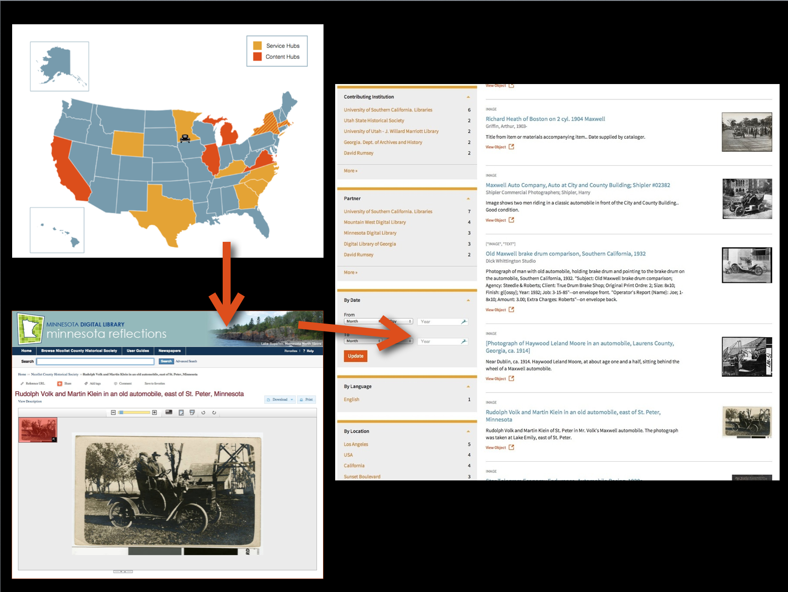

Luckily, NCHS works with the Minnesota Digital Library, which manages their digital collections. Luckily, MDL works with DPLA.    
And, luckily for you, you’ve found DPLA and all of the Maxwell Automobile images available from six institutions across the US, including that one from the NCHS.

------------------

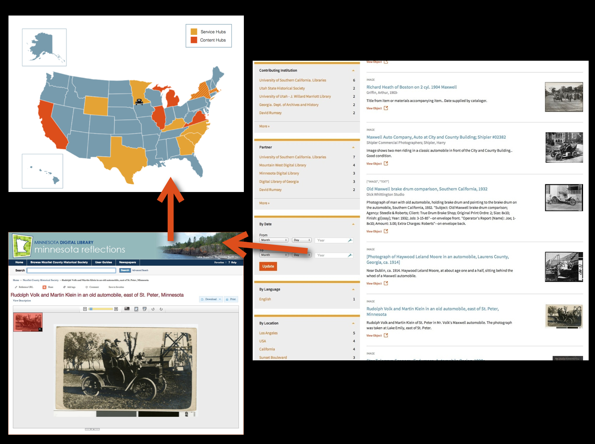

The luck continues--now you know about MDL because you’ve followed the link back to their site to see that awesome image.    
And, maybe now you know that the NCHS exists.   
And, just maybe you’ll visit their site, contact them, or spread the good word about how you found that image and where it comes from.

# Hubs as Local Connections {.takahashi}

As you can see, the hubs model allows local collections to become more easily discoverable.    
The hubs that assist us with bringing that content, as well as the partners that provide their hub with content, both serve a vital function.    
The hubs help mediate the relationship between the partners and DPLA.   
The partners are the local institutions with direct expertise and knowledge in the collections and the related subjects.    
Specifically, the partners and hubs provide an important *local* connection.

# Public Library Partnerships Project

Funded by Bill and Melinda Gates Foundation    
Partnering with four service hubs:    

* Digital Commonwealth
* Digital Library of Georgia
* Minnesota Digital Library
* Mountain West Digital Library 

<http://dp.la/info/about/projects/public-library-partnerships/>

DPLA has another opportunity to help strengthen the local connection between service hubs and the areas they serve.   
With the Public Library Partnerships Project, DPLA has the opportunity to provide public librarians in a small number of states with digital skills training.    
This project also allows public librarians in libraries with special collections to connect with their local service hub, which can provide additional resources at the state or regional level.     
The project will host 12 total workshops that will reach approximately 180 public librarians, teaching skills such as writing for the web, exhibition development, and understanding intellectual property rights.    
At the conclusion of the project, we will release a public version of the training materials that others can reuse.
Through PLPP, more public library content will appear in DPLA.   
Although the quality and sustainability of relationships between DPLA, Hubs, and public libraries is the bigger project priority, we will also be happy to grow our number of public library partners and establish an even stronger local connection.

# Personal Connections {.takahashi}

Of course, the hubs model allows us to do one kind of outreach.   
In addition to undertaking outreach to librarians and archivists, DPLA should also provide outreach to the general public
However, the DPLA staff is small, with seven current employees.
How can we improve outreach to new communities with this limitation, plus further limitations on our travel budgets?

# Community Reps {.takahashi}

In September 2013, DPLA staff conceived of a program of community representatives, or volunteers that would help spread the word about DPLA.
While DPLA was still in its planning phase, my colleagues found that our web forums and committees provided a forum for interested and motivated people to help out and give us feedback.
After transitioning to its own organization, we wanted to provide a means for people to get involved. 

# Responsibilities of Community Reps

* Organize activities that promote DPLA using DPLA materials
* Share materials and feedback from outreach efforts
* Check in with DPLA staff about progress and share experiences
* Be willing to participate in speaking or event opportunities as requested by DPLA
* Represent DPLA formally as an acknowledged Rep on our website and informally through various networks

# Thank You!

[\@anarchivist](https://twitter.com/anarchivist)

<mark@matienzo.org>

<http://matienzo.org/presentations>

  Closing slide notes.

