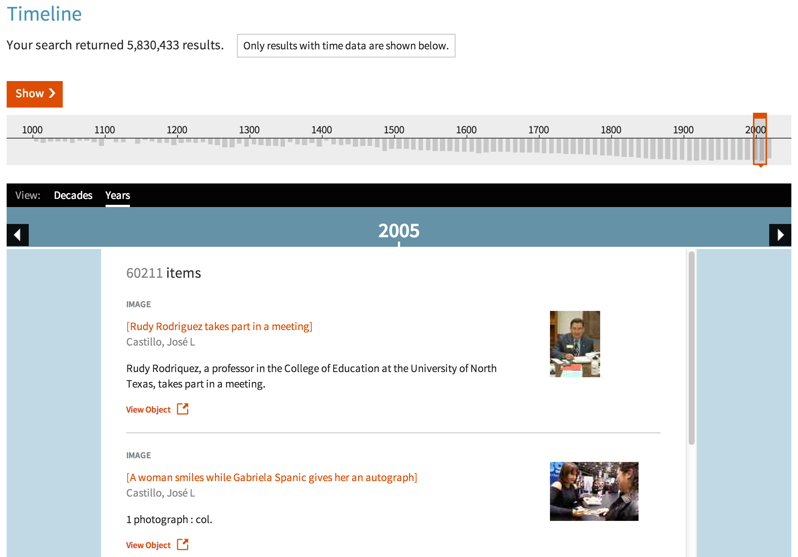
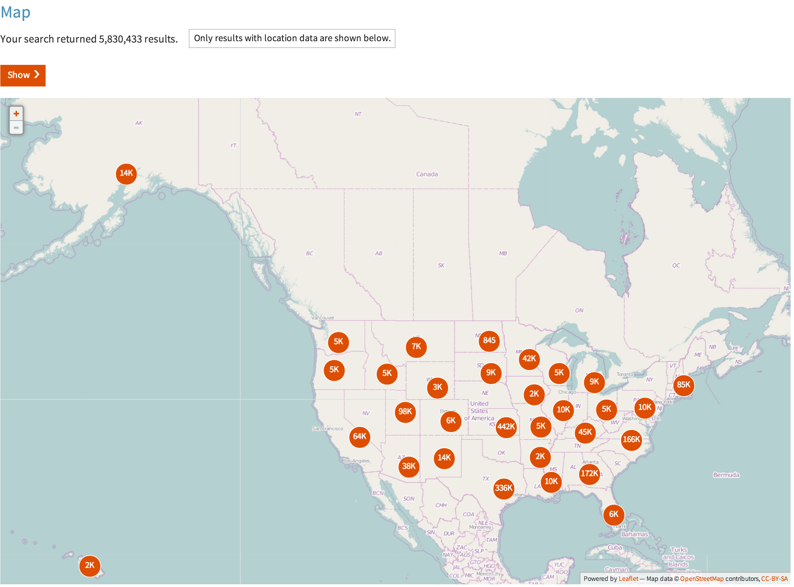

# Among Place and Non-Place {#first}
## Situating the Digital Public Library of America

Mark A. Matienzo   
Digital Public Library of America   
@anarchivist

British Columbia Library Association    
April 1, 2014

Slides: <http://matienzo.org/presentations/>

# What is DPLA? {.takahashi}

To start, I would first like to ask you a few questions.   
How many of you have heard of the Digital Public Library of America before?     
How many of you have used DPLA?    
If you're not familiar with DPLA, that's alright - I do understand that I'm in Canada.
The Digital Public Library of America brings together the riches of America’s libraries, archives, and museums, and makes them freely available to the world. It strives to contain the full breadth of human expression, from the written word, to works of art and culture, to records of America’s heritage, to the efforts and data of science. The DPLA aims to expand this crucial realm of openly available materials, and make those riches more easily discovered and more widely usable and used.

# The DPLA is ...

## a Portal
## a Platform
## an advocate for the Public Option

We describe DPLA in three ways:    
First, DPLA is a portal that delivers students, teachers, scholars, and the public to incredible resources, wherever they may be in America.    
Secondly, DPLA is a platform that enables xnew and transformative uses of our digitized cultural heritage.    
Thirdly, DPLA is an advocate for a strong public option in the twenty-first century. The DPLA works, along with like-minded organizations and individuals, to ensure that a critical, open intellectual landscape remains vibrant and broad in the face of increasingly restrictive digital options. The DPLA seeks to multiply openly accessible materials to strengthen the public option that libraries represent in their communities.

# A Portal for Discovery {#takahashi}
## [http://dp.la/](http://dp.la)

------------------

When you first visit DPLA's portal, you are given a variety of ways to find cultural materials. 

------------------

For example, you can perform simple searches, sort the results, and filter them by format, contributing institution or partner, date, language, location, or subject.

------------------

In addition to a familiar search paradigm, we provide a few additional interfaces that allow users to find and interact with collections in new ways.    
For example, we provide a timeline, which presents groupings of items or search results grouped by the date of creation or publication in an easy to browse format.
This can make it easier for some users to browse large result sets.

------------------

The DPLA Bookshelf provides is yet another way that we provide an innovative mechanism for users to interact with materials available through our portal.    
The items on Bookshelf represent digitized books available through the portal, from providers such as the University of California, the University of Illinois, and the New York Public Library.    
The shelf is shown as a vertical stack so that the titles and authors are more easily readable on their spines.    
The width of the book represents the actual height of the physical book, and its thickness represents its page count.    
The spine is colored with one of ten depths of blue to indicate how relevant the work is to the reader’s search.

------------------

When a reader clicks on one of the books, additional information about it is displayed to its right. The reader can open the book with the click of a button.    
Further, when a reader clicks on a book, the DPLA Bookshelf displays thumbnails of images within the DPLA collection related to that book’s subject areas.    
Clicking on a thumbnail displays the image and additional information about it.

------------------

In addition, can explore further by clicking on one of the subjects under which the book has been categorized.    
This replaces the existing shelf with a shelf containing all the other books in the DPLA collection categorized under that same subject.

------------------

We also provide a map-based interface that allows users to identify the places associated with a given item.
I'll be talking about the map, how we augment the data we receive to produce this map, and some of the issues we've identified in the process, later in the presentation.

------------------

In addition to these interfaces I've just discussed, DPLA also provides curated exhibitions that provide topical or historical context to some of the items to which we enable access.

# How is this possible? {.takahashi}

Now, you may wonder how this is possible, because those 5.8 million items had to come from somewhere.

# DPLA Hubs {.takahashi}

We have a partnership model which we refer to as our "hubs model."    
The Hubs Program is designed to establish a national network of state and regional digital libraries, as well as large institutional digital libraries.    
The hubs model allows us to bring together digitized content from across the country into a single access point for end users, and an open platform for developers.

# Content Hubs

The DPLA Content Hubs are large digital libraries, museums, archives, or repositories that maintain a one-to-one relationship with the DPLA.    
Content hubs tend to be larger, with collections exceeding 250K records and content previews (such as thumbnails or low resolution clips of audio/visual material).
Content hubs work with DPLA to globalize their data, meaning that they work with DPLA to normalize, clean, update their data, and investigate new methods for data sharing.

# Service Hubs

The DPLA Service Hubs are state or regional digital libraries that aggregate information about digital objects from libraries, archives, museums, and other cultural heritage institutions within its given state or region.    
Like content hubs, service hubs share data and content previews and work iwth DPLA to globalize their data. 
In addition, service hubs also represent their community as single metadata aggregation point (state, region, etc., but perhaps differently defined communities in the future).   
Each Service Hub also offers its state or regional partners a full menu of standardized digital services, including digitization, metadata, data aggregation and storage services, as well as locally hosted community outreach programs, bringing users in contact with digital content of local relevance.   

# A Network of Partners

But, the DPLA is really made up of over 1,100 partners--institutions and organizations from across the US--that provide content to or are hosted by (or have some other relationship with) our Hubs. In turn, the Hubs serve up this content to DPLA. 

# Thank You!

[\@anarchivist](https://twitter.com/anarchivist)

<mark@matienzo.org>

<http://matienzo.org/presentations>

  Closing slide notes.

